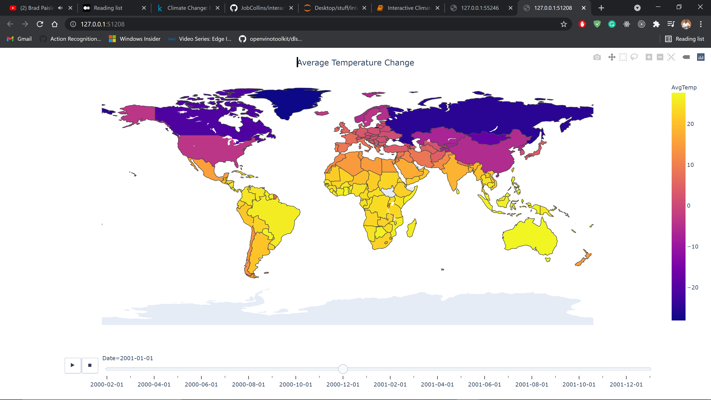

# interactive-climate-map

Two interactive climate maps. The first one will be showing the climate change of each country, and the second one will be showing the temperature change over time.

## Understanding the Data

The Berkeley Earth Surface Temperature Study combines 1.6 billion temperature reports from 16 pre-existing archives. It is nicely packaged and allows for slicing into interesting subsets (for example by country). They publish the source data and the code for the transformations they applied.
